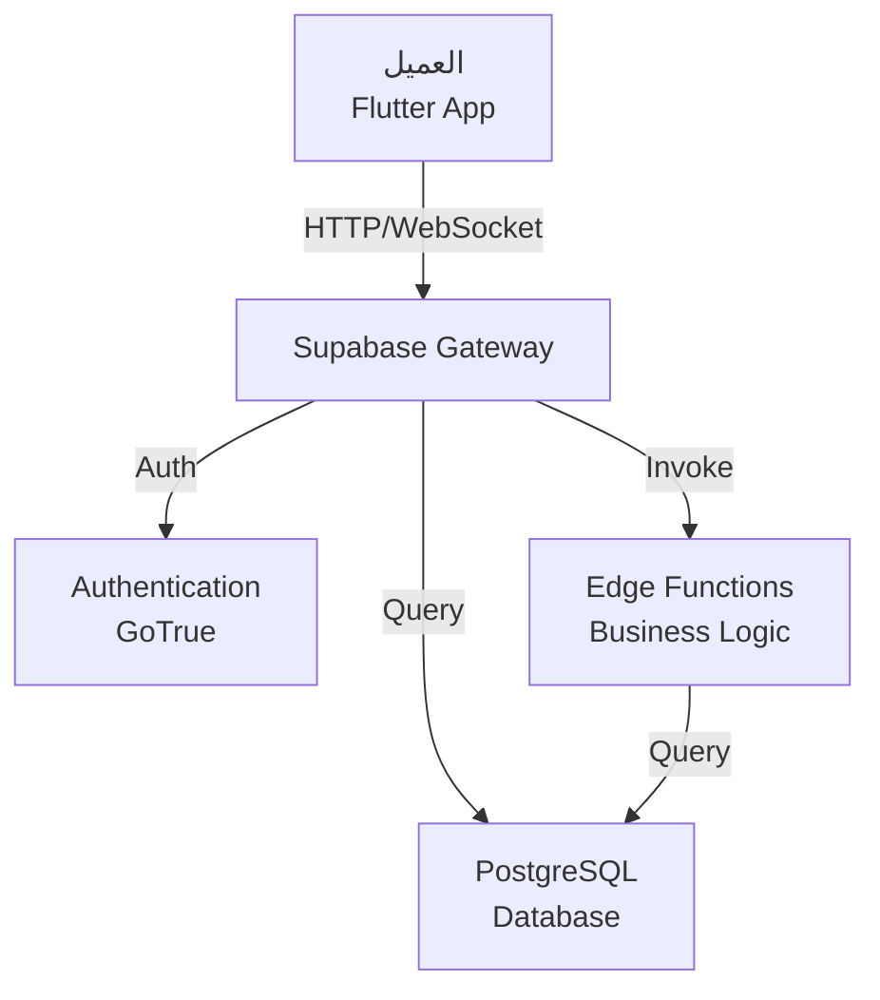

# تصميم API والخدمات

## نموذج الـ API

نظام MCS يستخدم نموذج **REST** عبر **Supabase Edge Functions** و **Supabase Client**



---

## معايير الـ API

### HTTP Methods

| Method | الاستخدام | الوصف |
|--------|----------|--------|
| **GET** | قراءة البيانات | استرجاع الموارد |
| **POST** | إنشاء موارد | إضافة بيانات جديدة |
| **PUT/PATCH** | تحديث البيانات | تعديل موارد موجودة |
| **DELETE** | حذف البيانات | إزالة موارد |

### Status Codes

```
✅ 200 OK              - الطلب نجح
✅ 201 Created         - تم إنشاء مورد جديد
✅ 204 No Content      - النجاح بدون محتوى

⚠️  400 Bad Request    - طلب غير صحيح
⚠️  401 Unauthorized   - عدم المصادقة
⚠️  403 Forbidden      - لا توجد أذونة
⚠️  404 Not Found      - المورد غير موجود
⚠️  409 Conflict       - تضارب في البيانات

❌ 500 Server Error    - خطأ في الخادم
❌ 503 Service Unavailable
```

---

## Endpoints الرئيسية

### Authentication API

#### تسجيل الدخول

```rest
POST /auth/login
Content-Type: application/json

{
  "email": "user@example.com",
  "password": "password123"
}

Response: 200 OK
{
  "user": {
    "id": "uuid",
    "email": "user@example.com",
    "role": "patient"
  },
  "session": {
    "access_token": "jwt_token",
    "refresh_token": "refresh_token",
    "expires_at": 1234567890
  }
}
```

#### التسجيل

```rest
POST /auth/register
Content-Type: application/json

{
  "email": "patient@example.com",
  "password": "password123",
  "first_name": "احمد",
  "last_name": "محمد",
  "role": "patient"
}

Response: 201 Created
{
  "user": { /* user data */ },
  "session": { /* session data */ }
}
```

#### التحقق من OTP

```rest
POST /auth/verify-otp
Content-Type: application/json

{
  "email": "user@example.com",
  "otp": "123456"
}

Response: 200 OK
{
  "verified": true,
  "token": "jwt_token"
}
```

---

### Patients API

#### الحصول على ملف المريض

```rest
GET /api/patients/:patientId
Authorization: Bearer {access_token}

Response: 200 OK
{
  "id": "uuid",
  "user_id": "uuid",
  "date_of_birth": "1990-01-01",
  "gender": "male",
  "blood_type": "O+",
  "allergies": ["Penicillin"],
  "chronic_diseases": ["Diabetes"],
  "emergency_contact": "احمد علي",
  "emergency_phone": "+966501234567",
  "clinic_id": "uuid",
  "created_at": "2024-01-01T10:00:00Z",
  "updated_at": "2024-01-15T10:00:00Z"
}
```

#### تحديث ملف المريض

```rest
PUT /api/patients/:patientId
Authorization: Bearer {access_token}
Content-Type: application/json

{
  "phone": "+966501234567",
  "emergency_contact": "احمد علي",
  "emergency_phone": "+966509876543",
  "allergies": ["Penicillin", "Aspirin"]
}

Response: 200 OK
{ /* updated patient data */ }
```

#### الحصول على السجلات الطبية

```rest
GET /api/patients/:patientId/medical-records
Authorization: Bearer {access_token}
Query: ?from=2024-01-01&to=2024-12-31&limit=50

Response: 200 OK
{
  "records": [
    {
      "id": "uuid",
      "appointment_id": "uuid",
      "doctor_name": "الدكتور احمد",
      "specialty": "القلب",
      "visit_date": "2024-03-15",
      "diagnosis": "ارتفاع ضغط الدم",
      "notes": "المريض بحالة جيدة",
      "prescriptions": []
    }
  ],
  "total": 10,
  "page": 1,
  "per_page": 50
}
```

---

### Appointments API

#### حجز موعد

```rest
POST /api/appointments
Authorization: Bearer {access_token}
Content-Type: application/json

{
  "doctor_id": "uuid",
  "appointment_date": "2024-04-15T10:30:00Z",
  "reason_for_visit": "الفحص العام"
}

Response: 201 Created
{
  "id": "uuid",
  "doctor_id": "uuid",
  "patient_id": "uuid",
  "appointment_date": "2024-04-15T10:30:00Z",
  "status": "scheduled",
  "reason_for_visit": "الفحص العام",
  "created_at": "2024-03-20T10:00:00Z"
}
```

#### الحصول على المواعيد

```rest
GET /api/appointments
Authorization: Bearer {access_token}
Query: ?status=scheduled&from=2024-04-01&limit=20

Response: 200 OK
{
  "appointments": [
    {
      "id": "uuid",
      "doctor": {
        "id": "uuid",
        "name": "الدكتور احمد",
        "specialty": "القلب",
        "rating": 4.8
      },
      "clinic": {
        "id": "uuid",
        "name": "عيادة النور",
        "address": "الرياض"
      },
      "appointment_date": "2024-04-15T10:30:00Z",
      "status": "scheduled"
    }
  ],
  "total": 5,
  "page": 1
}
```

#### إلغاء موعد

```rest
DELETE /api/appointments/:appointmentId
Authorization: Bearer {access_token}

Response: 204 No Content
```

---

### Doctors API

#### الحصول على قائمة الأطباء

```rest
GET /api/doctors
Query: ?specialty=القلب&city=الرياض&rating_min=4.0&limit=20&page=1

Response: 200 OK
{
  "doctors": [
    {
      "id": "uuid",
      "name": "الدكتور احمد محمد",
      "specialty": "القلب",
      "clinic": {
        "name": "عيادة النور",
        "address": "الرياض"
      },
      "experience_years": 15,
      "consultation_fee": 150,
      "rating": 4.8,
      "total_consultations": 2500,
      "is_available": true,
      "availability": {
        "monday": ["09:00", "10:00", "14:00"],
        "tuesday": ["09:00", "11:00"],
        "wednesday": ["15:00", "16:30"]
      }
    }
  ],
  "total": 45,
  "page": 1,
  "per_page": 20
}
```

#### ملف الطبيب

```rest
GET /api/doctors/:doctorId
Authorization: Bearer {access_token}

Response: 200 OK
{
  "id": "uuid",
  "name": "الدكتور احمد",
  "license_number": "LIC123456",
  "specialty": "القلب",
  "clinic": { /* clinic info */ },
  "experience_years": 15,
  "qualifications": ["MBBS", "MD Cardiology"],
  "consultation_fee": 150,
  "rating": 4.8,
  "total_consultations": 2500,
  "reviews": [ /* patient reviews */ ]
}
```

---

### Prescriptions API

#### الحصول على الوصفات

```rest
GET /api/prescriptions
Authorization: Bearer {access_token}

Response: 200 OK
{
  "prescriptions": [
    {
      "id": "uuid",
      "appointment_id": "uuid",
      "doctor_name": "الدكتور احمد",
      "prescribed_date": "2024-03-15",
      "items": [
        {
          "id": "uuid",
          "medication_name": "Lisinopril",
          "dosage": "10mg",
          "frequency": "مرة يومياً",
          "quantity": 30,
          "duration_days": 30
        }
      ]
    }
  ]
}
```

#### تحميل الوصفة كـ PDF

```rest
GET /api/prescriptions/:prescriptionId/download
Authorization: Bearer {access_token}

Response: 200 OK
Content-Type: application/pdf
{ /* PDF file */ }
```

---

### Invoices API

#### الحصول على الفواتير

```rest
GET /api/invoices
Authorization: Bearer {access_token}
Query: ?status=pending&from_date=2024-01-01&limit=50

Response: 200 OK
{
  "invoices": [
    {
      "id": "uuid",
      "invoice_number": "INV-2024-001",
      "appointment": {
        "id": "uuid",
        "doctor_name": "الدكتور احمد",
        "date": "2024-03-15"
      },
      "total_amount": 150,
      "tax": 22.50,
      "currency": "SAR",
      "status": "pending",
      "issue_date": "2024-03-15",
      "due_date": "2024-04-15"
    }
  ],
  "total": 10,
  "total_amount": 1500
}
```

#### الدفع

```rest
POST /api/invoices/:invoiceId/pay
Authorization: Bearer {access_token}
Content-Type: application/json

{
  "payment_method": "credit_card",
  "amount": 150,
  "currency": "SAR"
}

Response: 200 OK
{
  "transaction_id": "tx_123456",
  "status": "completed",
  "amount": 150,
  "timestamp": "2024-03-20T10:30:00Z"
}
```

---

### Subscriptions API

#### الاشتراك في عيادة

```rest
POST /api/subscriptions
Authorization: Bearer {access_token}
Content-Type: application/json

{
  "clinic_id": "uuid",
  "plan_type": "professional",
  "payment_method": "credit_card"
}

Response: 201 Created
{
  "id": "uuid",
  "clinic_id": "uuid",
  "plan_type": "professional",
  "start_date": "2024-03-20",
  "end_date": "2024-04-20",
  "status": "active",
  "features": {
    "max_doctors": 50,
    "max_patients": 10000,
    "max_appointments": 100000
  }
}
```

---

### Video Call API

#### بدء مكالمة فيديو

```rest
POST /api/video-calls/start
Authorization: Bearer {access_token}
Content-Type: application/json

{
  "appointment_id": "uuid",
  "participant_type": "patient" // or "doctor"
}

Response: 201 Created
{
  "session_id": "session_uuid",
  "token": "agora_token",
  "server_url": "wss://signal.agora.io",
  "channel": "appointment_uuid",
  "uid": 12345,
  "expires_at": 1234567890
}
```

---

## الأخطاء القياسية

### نموذج خطأ

```json
{
  "error": {
    "code": "VALIDATION_ERROR",
    "message": "البريد الإلكتروني غير صحيح",
    "details": [
      {
        "field": "email",
        "message": "يجب أن يكون بريد إلكتروني صحيح"
      }
    ],
    "timestamp": "2024-03-20T10:30:00Z",
    "request_id": "req_123456"
  }
}
```

### أنواع الأخطاء

| الكود | الوصف |
|------|--------|
| `INVALID_CREDENTIALS` | بيانات دخول خاطئة |
| `EMAIL_EXISTS` | البريد موجود بالفعل |
| `PATIENT_NOT_FOUND` | المريض غير موجود |
| `DOCTOR_NOT_FOUND` | الطبيب غير موجود |
| `APPOINTMENT_CONFLICT` | تضارب في المواعيد |
| `INVALID_CLINIC_SUBSCRIPTION` | اشتراك غير صحيح |
| `INSUFFICIENT_BALANCE` | رصيد غير كافي |
| `RATE_LIMIT_EXCEEDED` | تجاوز حد الطلبات |

---

## التوثيق والح صول

### معايير الحصول

```rest
Authorization: Bearer {jwt_token}

Headers:
{
  "Authorization": "Bearer eyJhbGc...",
  "Content-Type": "application/json",
  "Accept-Language": "ar",
  "User-Agent": "MCS/1.0.0"
}
```

### تحديث الـ Token

```rest
POST /auth/refresh-token
Content-Type: application/json

{
  "refresh_token": "refresh_token_value"
}

Response: 200 OK
{
  "access_token": "new_jwt_token",
  "refresh_token": "new_refresh_token",
  "expires_in": 3600
}
```

---

## معايير الاستعلام (Query Parameters)

### Pagination

```rest
GET /api/appointments?page=1&limit=20&sort=-appointment_date

page: رقم الصفحة (افتراضي: 1)
limit: عدد النتائج (افتراضي: 20، أقصى: 100)
sort: الفرز (+field أو -field)
```

### Filtering

```rest
GET /api/doctors?specialty=القلب&city=الرياض&rating_min=4.0

specialty: التخصص
city: المدينة
rating_min: الحد الأدنى للتقييم
rating_max: الحد الأقصى للتقييم
```

### Search

```rest
GET /api/doctors/search?q=احمد&type=name

q: نص البحث
type: نوع البحث (name, clinic, specialty)
```

---

## معايير الأداء

### حدود الطلب

```
┌─────────────────────────────────────┐
│         Rate Limits                 │
├─────────────────────────────────────┤
│ ✓ 100 request/minute per user       │
│ ✓ 1000 request/minute per IP        │
│ ✓ 10000 request/hour per app        │
│ ✓ Response time < 200ms             │
└─────────────────────────────────────┘
```

### Caching

```rest
GET /api/doctors/list
Cache-Control: max-age=3600, public

ETag: "W/"123abc""
If-None-Match: "W/"123abc""
```

---

## WebSocket والاتصالات الفورية

### Real-time Events

```javascript
// الاشتراك في تحديثات المواعيد
const channel = supabase
  .channel('appointments:patient_' + patientId)
  .on(
    'postgres_changes',
    {
      event: '*',
      schema: 'public',
      table: 'appointments',
      filter: `patient_id=eq.${patientId}`,
    },
    (payload) => {
      console.log('Appointment changed:', payload);
      // تحديث الواجهة
    }
  )
  .subscribe();
```

---

## أفضل الممارسات

### 1. استخدم Pagination

```
✅ GET /api/doctors?page=1&limit=20
❌ GET /api/doctors (يمكن أن يرجع الكل)
```

### 2. استخدم HTTP Methods الصحيحة

```
✅ POST لإنشاء
✅ PUT/PATCH لتحديث
✅ DELETE للحذف
✅ GET للقراءة
```

### 3. معالجة الأخطاء

```dart
try {
  final response = await dio.get('/api/doctors');
  // handle success
} on DioException catch (e) {
  if (e.response?.statusCode == 404) {
    // Handle not found
  } else if (e.response?.statusCode == 401) {
    // Handle unauthorized
  }
}
```

### 4. استخدم Filters بدل Fetch All

```
✅ GET /api/appointments?status=scheduled&from=2024-04-01
❌ GET /api/appointments (ثم تصفية محلياً)
```

