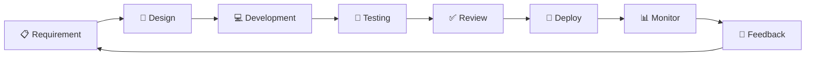

# سير العمل والتطوير

## دورة الحياة التطويرية



---

## خطوات العملية (Process Steps)

### 1. تحليل المتطلبات

| الخطوة | الوصف | المسؤول | الوقت |
|--------|--------|----------|--------|
| ** تعريف** | فهم المتطلب الكامل | Product Manager | 30 دقيقة |
| **توثيق** | كتابة متطلبات واضحة | Technical Lead | 1 ساعة |
| **تقدير** | تقدير الجهد اللازم | Development Team | 45 دقيقة |
| **موافقة** | موافقة الفريق | Project Manager | 15 دقيقة |

### 2. التصميم

```dart
// خطوات التصميم
1. رسم النموذج (Mockup)
2. تحديد البيانات المطلوبة
3. تصميم قاعدة البيانات
4. تصميم الواجهات
5. تعريف APIs المطلوبة
```

### 3. التطوير

```bash
# إنشاء branch جديد
git checkout -b feature/auth-login

# تطوير الميزة
# - كتابة الكود
# - إنشاء tests
# - توثيق الكود

# commit النتائج
git add .
git commit -m "feat: implement login functionality"
```

### 4. الاختبار

```dart
// levels من الاختبارات
✓ Unit Tests (اختبارات الوحدات)
✓ Widget Tests (اختبارات الأدوات)
✓ Integration Tests (اختبارات التكامل)
✓ End-to-End Tests (اختبارات النهاية)
```

### 5. المراجعة

```
PR Review Process:
1. فتح Pull Request
2. انتظار المراجعة
3. معالجة التعليقات
4. الموافقة والدمج
```

### 6. النشر

```bash
# Build Release
flutter build apk
flutter build ipa
flutter build web

# Deploy
# - فحص الجودة
# - نشر على الإنتاج
# - مراقبة الأخطاء
```

---

## إدارة الإصدارات (Version Control)

### استراتيجية الفروع (Git Branching Strategy)

```
main (production)
  ↑
  ├─ release/v1.0.0 (release candidate)
  │
staging (staging environment)
  ↑
  ├─ feature/auth-login
  ├─ feature/patient-dashboard
  ├─ bugfix/login-error
  ├─ chore/update-dependencies
  │
develop (development base)
```

### قواعد تسمية الفروع

```bash
# Feature branch
feature/auth-login
feature/patient-dashboard
feature/video-call

# Bug fix branch
bugfix/login-error
bugfix/ui-alignment

# Chore branch
chore/update-dependencies
chore/cleanup-code

# Hotfix branch (من main)
hotfix/critical-bug-fix
```

### قواعد الـ Commit

```bash
# ✅ Conventional Commits Format
feat: add login functionality
fix: resolve authentication error
docs: update readme
style: format code
refactor: reorganize auth module
test: add login tests
chore: update dependencies

# مثال كامل
feat(auth): implement two-factor authentication

- Add OTP verification
- Update user model
- Add SMS service integration

Closes #123
```

---

## إدارة الـ Pull Requests

### قالب PR (PR Template)

```markdown
## الوصف
وصف واضح لما تفعله هذه الـ PR

## نوع التغيير
- [ ] Feature (ميزة جديدة)
- [ ] Bug Fix (إصلاح خطأ)
- [ ] Documentation (توثيق)
- [ ] Refactoring (إعادة تنظيم)

## التغييرات الرئيسية
- تغيير 1
- تغيير 2
- تغيير 3

## الاختبارات
- [ ] تم اختبار جميع الحالات
- [ ] تم إضافة unit tests
- [ ] تم اختبار على جميع المنصات

## قائمة التحقق قبل المراجعة
- [ ] الكود يتبع معايير المشروع
- [ ] لا توجد أخطاء تحليل
- [ ] التوثيق محدث
- [ ] لا توجد أخطاء في الأداء
```

### عملية المراجعة

| المرحلة | الفحص | المراجع |
|--------|------|---------|
| **الكود** | معايير الكود، الأداء | Senior Developer |
| **الاختبار** | تغطية الاختبار | QA Lead |
| **الأمان** | ثغرات أمان | Security Team |
| **التوثيق** | وضوح الوثائق | Technical Writer |
| **الموافقة** | القرار النهائي | Project Lead |

---

## إدارة المشاكل والحشرات

### حلقة حياة المشكلة (Issue Lifecycle)

```
┌─────────┐
│ CREATED │
│  جديدة  │
└────┬────┘
     │
     ↓
┌─────────┐
│ TRIAGED │
│ تصنيفة  │
└────┬────┘
     │
     ↓
┌─────────┐
│  IN DEV │
│ مقيد    │
└────┬────┘
     │
     ↓
┌─────────┐
│ PR OPEN │
│ PR مفتوح│
└────┬────┘
     │
     ↓
┌─────────┐
│  CLOSED │
│ مغلق    │
└────┬────┘
     │
     ↓
┌─────────┐
│VERIFIED │
│ تم التحق│
└─────────┘
```

### أولويات المشاكل

| الأولوية | الوقت المتوقع | الوصف |
|----------|-----------|--------|
| **Critical** 🔴 | فوري (24ساعة) | يوقف النظام |
| **High** 🟠 | أسبوع واحد | يؤثر على الأداء |
| **Medium** 🟡 | كل أسبوعين | مشكلة عادية |
| **Low** 🟢 | شهر | تحسينات وتنظيف |

---

## دورة القيادة (Release Cycle)

### مراحل الإصدار

```
┌─────────────────────────────────────┐
│        Release Cycle v1.2.0          │
├─────────────────────────────────────┤
│ Week 1-2: Feature Development       │
│ Week 3: Bug Fixes & Testing         │
│ Week 4: Release Candidate           │
│ Week 5: Production Release          │
└─────────────────────────────────────┘
```

### خطوات الإصدار

```bash
# 1. إنشاء release branch
git checkout -b release/v1.2.0

# 2. تحديث الإصدار
# - pubspec.yaml version
# - CHANGELOG.md
# - build.gradle (لـ Android)

# 3. الاختبار النهائي
flutter test
flutter analyze

# 4. دمج مع main
git checkout main
git merge --no-ff release/v1.2.0

# 5. إنشاء tag
git tag -a v1.2.0 -m "Release version 1.2.0"

# 6. النشر
flutter build apk
flutter build ipa
flutter build web
```

---

## بيئات التطوير

### بيئات متعددة

```
┌──────────────────────────────────────────┐
│         DEVELOPMENT ENVIRONMENTS         │
├──────────────────────────────────────────┤
│ LOCAL                                    │
│ - على جهاز المطور                       │
│ - قاعدة بيانات محلية                    │
│ - API محليًا                            │
│                                          │
│ DEVELOPMENT                              │
│ - خادم تطوير مشترك                      │
│ - قاعدة بيانات تطوير                    │
│ - بيانات اختبارية                       │
│                                          │
│ STAGING                                  │
│ - بيئة تشابه الإنتاج                    │
│ - قاعدة بيانات حقيقية                   │
│ - اختبار مكامل قبل النشر               │
│                                          │
│ PRODUCTION                               │
│ - بيئة العملاء الحقيقية                 │
│ - قاعدة بيانات الإنتاج                 │
│ - بيانات حقيقية للعملاء                │
└──────────────────────────────────────────┘
```

### ملف الإعدادات

```bash
# .env.development
SUPABASE_URL=https://dev.supabase.co
SUPABASE_KEY=dev-key
ENV=development

# .env.staging
SUPABASE_URL=https://staging.supabase.co
SUPABASE_KEY=staging-key
ENV=staging

# .env.production
SUPABASE_URL=https://prod.supabase.co
SUPABASE_KEY=prod-key
ENV=production
```

---

## أدوات CI/CD

### GitHub Actions

```yaml
name: Flutter CI/CD

on:
  push:
    branches: [main, develop]
  pull_request:
    branches: [main, develop]

jobs:
  analyze:
    runs-on: ubuntu-latest
    steps:
      - uses: actions/checkout@v2
      - name: Setup Flutter
        uses: subosito/flutter-action@v2
      - name: Analyze code
        run: flutter analyze
      
  test:
    runs-on: ubuntu-latest
    steps:
      - uses: actions/checkout@v2
      - name: Setup Flutter
        uses: subosito/flutter-action@v2
      - name: Run tests
        run: flutter test
```

---

## قالب الاجتماع اليومي

### Daily Standup (15 دقيقة)

```
1. قالشخصي الأمس:
   - ماذا أنجزت؟
   - ما المشاكل التي واجهتك؟

2. اليوم:
   - ما الذي تخطط للقيام به؟
   - هل تحتاج إلى مساعدة؟

3. المشاكل:
   - عوائق أو مشاكل؟
```

---

## فترات الإصدار والمراجعة

| النشاط | الجدول الزمني |
|--------|----------|
| **مراجعة متطلبات** | الجمعة 10:00 AM |
| **Daily Standup** | يومياً 09:00 AM |
| **Sprint Planning** | الاثنين 02:00 PM |
| **Sprint Review** | الخميس 04:00 PM |
| **Retrospective** | الخميس 05:00 PM |
| **Release** | كل أسبوعين الثلاثاء |

---

## أفضل الممارسات

### 1. Keep Branches Small
```
✅ Branch يحتوي على ميزة واحدة فقط
❌ Branch يحتوي على عدة ميزات
```

### 2. Commit Often
```
✅ عدة commits صغيرة وواضحة
❌ commit واحد ضخم مع كل شيء
```

### 3. Test Before Push
```
✅ اختبر محلياً قبل دفع الكود
❌ ادفع الكود بدون اختبار
```

### 4. Write Good PR Descriptions
```
✅ وصف واضح للمشكلة والحل
❌ PR بدون وصف واضح
```

### 5. Review Code Respectfully
```
✅ تعليقات بناءة وودية
❌ انتقادات حادة
```

---

## الأتمتة والسكريبتات

### سكريبت الإعداد المبدئي

```bash
#!/bin/bash
# setup.sh

echo "🚀 تثبيت المشروع..."

# تثبيت الاعتماديات
flutter pub get

# تشغيل build runner
dart run build_runner build

# تشغيل التحليل
flutter analyze

# اختبار الكود
flutter test

echo "✅ تم الإعداد بنجاح!"
```

### سكريبت الاختبار

```bash
#!/bin/bash
# test.sh

echo "🧪 تشغيل الاختبارات..."

flutter test --coverage

# Generate coverage report
# genhtml coverage/lcov.info -o coverage/html

echo "✅ انتهت الاختبارات!"
```

