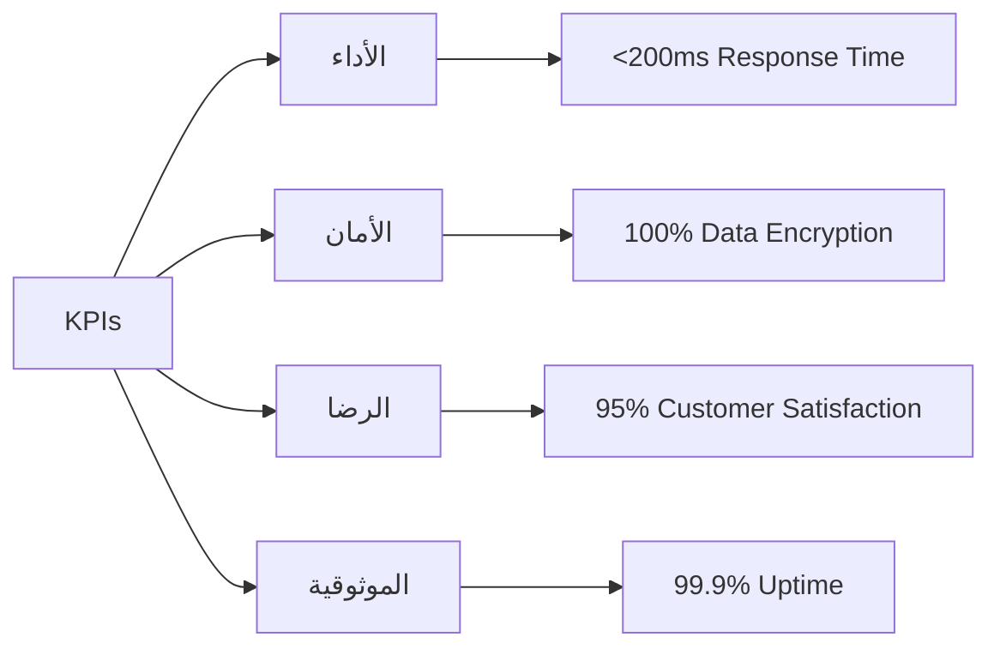

# الأهداف والنطاق

## الأهداف الرئيسية للمشروع

### 1. الأهداف التجارية

| الهدف | الوصف | المقياس |
|------|--------|---------|
| **توسيع السوق** | الوصول إلى عيادات جديدة | 500+ عيادة في السنة الأولى |
| **زيادة الإيرادات** | تحقيق استدامة مالية | 100,000$ إيراد سنوي |
| **تحسين رضا العملاء** | نسبة رضا عالية | 95% رضا العملاء |
| **السمعة** | تصبح الحل الأول | رقم 1 في السوق |

### 2. الأهداف التقنية

| الهدف | الوصف | المتوقع |
|------|--------|----------|
| **الأداء** | سرعة استجابة عالية | <200ms |
| **الموثوقية** | نسبة التوفر | 99.9% uptime |
| **الأمان** | حماية البيانات | تشفير end-to-end |
| **التوسعية** | القابلية للنمو | 100,000+ مستخدم |
| **الصيانة** | سهولة التحديث | تحديث بدون توقف |

### 3. الأهداف التجريبية

| الهدف | الوصف | النتيجة |
|------|--------|----------|
| **تجربة المستخدم** | واجهة سهلة الاستخدام | NPS > 70 |
| **الدعم** | دعم فني 24/7 | وقت استجابة <1 ساعة |
| **الموثوقية** | نظام موثوق | صفر أخطاء حرجة |

---

## نطاق المشروع (Scope)

### المدرج (Included)

#### المرحلة 1: الأساسيات
- ✅ نظام المصادقة والتفويض
- ✅ إدارة المرضى
- ✅ إدارة الأطباء والموظفين
- ✅ نظام المواعيد
- ✅ الفواتير والدفع
- ✅ الإشعارات الأساسية

#### المرحلة 2: التقدم
- ✅ المخزون والأدوية
- ✅ الوصفات الرقمية
- ✅ التقارير الإحصائية
- ✅ إدارة الاشتراكات
- ✅ لوحات التحكم المتقدمة

#### المرحلة 3: المميزات الإضافية
- ✅ الفيديو كونفرنس
- ✅ الرسائل الفورية
- ✅ التكامل مع الأنظمة الخارجية
- ✅ التقارير المتقدمة

### غير المدرج (Excluded)

| العنصر | السبب |
|--------|------|
| **التوازي المتقدم** | خارج النطاق الحالي |
| **الذكاء الاصطناعي التشخيصي** | يتطلب بيانات تدريبية বিশাল |
| **التكامل مع جميع المستشفيات** | محدود للعيادات المستقلة |
| **نطاق جغرافي عالمي** | ركزنا على السوق المحلي أولاً |

---

## حدود النطاق (Boundaries)

### المنصات المدعومة

```
✅ Web (Chrome, Firefox, Safari)
✅ iOS (تطبيق محلي)
✅ Android (تطبيق محلي)
✅ Windows (تطبيق سطح المكتب)
✅ macOS (تطبيق سطح المكتب)
❌ Linux واجهة سطح المكتب (مستقبلاً)
```

### الحد الأقصى للمستخدمين

- **العيادة الواحدة**: 100 مستخدم متزامن
- **النظام كله**: 100,000 مستخدم
- **المخزن المؤقت**: 10,000 طلب/ثانية

### قيود البيانات

| القيد | الحد |
|------|-----|
| **حجم ملف واحد** | 100 MB |
| **سجل المريض** | 10 GB لكل عيادة |
| **السجلات الكلية** | 1 TB لكل سنة |

---

## معايير النجاح

### المؤشرات الرئيسية (KPIs)



### المراحل الزمنية

| المرحلة | الهدف | الموعد |
|--------|------|--------|
| **Alpha** | اختبار داخلي | يناير 2026 |
| **Beta** | اختبار من قبل العملاء | فبراير 2026 |
| **Launch** | إطلاق رسمي | مارس 2026 |
| **Growth** | نمو وتطوير | يونيو 2026 |

---

## القيود والافتراضات

### القيود

1. **قيود تقنية**
   - الاعتماد على Supabase
   - الاعتماد على Firebase (للإشعارات)
   - يتطلب اتصال إنترنت مستمر

2. **قيود الموارد**
   - فريق 5-10 مطورين
   - ميزانية محدودة
   - جدول زمني ضيق

3. **قيود سياسية وقانونية**
   - الامتثال لقوانين الخصوصية
   - حماية بيانات المرضى
   - الامتثال HIPAA (مستقبلاً)

### الافتراضات

| الافتراض | الآثار |
|----------|--------|
| توفر الإنترنت | تطبيق سحابي بالكامل |
| دعم متصفحات حديثة | لا ندعم IE11 |
| الموافقة على Supabase | الالتزام طويل الأجل |
| الموارد متاحة | الجدول الزمني معقول |

---

## مخاطر المشروع

### المخاطر العليا

| المخطر | الاحتمالية | التأثير | الخطة |
|--------|-----------|---------|-------|
| **تأخر التطوير** | عالية | عالي | إضافة موارد |
| **فشل الأمان** | متوسطة | حرج | مراجعة أمان دورية |
| **فقدان البيانات** | منخفضة | حرج | نسخ احتياطية منتظمة |
| **تأخر العملاء** | عالية | متوسط | دعم فني محسن |

---

## معايير الخروج (Exit Criteria)

### المعايير لإكمال المشروع

- ✅ جميع الميزات الأساسية تعمل بدون أخطاء
- ✅ اختبار شامل لجميع المنصات
- ✅ وثائق كاملة
- ✅ دعم فني موجود
- ✅ موافقة العملاء
- ✅ أداء مقبول

---

## المخرجات (Deliverables)

### التسليمات الرئيسية

1. **التطبيق**
   - Web (تطبيق مستجيب)
   - iOS (تطبيق محلي)
   - Android (تطبيق محلي)
   - Windows (تطبيق سطح مكتب)
   - macOS (تطبيق سطح مكتب)

2. **الوثائق**
   - دليل المستخدم
   - دليل المطور
   - دليل الإدارة

3. **الدعم**
   - نظام التذاكر
   - الدعم الفني
   - التحديثات

