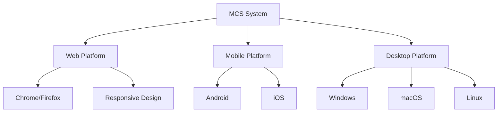

# نظرة عامة على مشروع MCS

## معلومات المشروع الأساسية

| الخاصية | القيمة |
|--------|--------|
| **اسم المشروع** | MCS - Medical Clinic Management System |
| **الوصف** | نظام إدارة شامل للعيادات الطبية متعدد المنصات |
| **النوع** | تطبيق متعدد المنصات (Web, Mobile, Desktop) |
| **الحالة** | في المرحلة النهائية من التطوير |
| **آخر تحديث** | مارس 2026 |
| **اللغات المدعومة** | العربية، الإنجليزية |
| **الواجهات الرئيسية** | RTL/LTR، Dark/Light Theme |

---

## وصف المشروع

**MCS** هو نظام إدارة عيادات متكامل يوفر حلاً شاملاً لإدارة جميع جوانب العمل الطبي وإداري للعيادات. يدعم النظام عدة أدوار مستخدمين:

### الأدوار الرئيسية للمستخدمين

| الدور | الوصف | المميزات الرئيسية |
|------|--------|------|
| **المريض** | المريض النهائي | حجز المواعيد، عرض السجلات الطبية، التواصل مع الأطباء |
| **الطبيب** | الطاقم الطبي | إدارة المريض، كتابة الوصفات، إجراء الفحوصات |
| **الموظف** | الموظف الإداري | إدارة المواعيد، المخزون، الفواتير |
| **المدير** | مدير العيادة | تقارير إحصائية، إدارة الفريق |
| **المسؤول الأساسي** | Super Admin | إدارة العيادات والاشتراكات والعملات |

---

## المنصات المدعومة

---

## الخصائص الرئيسية

### 1. إدارة المواعيد
- حجز وإلغاء المواعيد
- جدولة تلقائية
- تنبيهات وتذكيرات
- معايرة متعددة

### 2. إدارة المرضى
- سجلات طبية شاملة
- تاريخ المرض
- الأدوية الحالية
- الحساسيات

### 3. الوصفات الطبية
- إنشاء وصفات رقمية
- طباعة وتصدير
- تتبع الأدوية

### 4. الفواتير والدفع
- فواتير آلية
- طرق دفع متعددة
- تقارير مالية

### 5. الاشتراكات
- خطط اشتراكية مختلفة
- إدارة الترخيص
- أكواد ترويجية

### 6. المخزون
- إدارة الأدوية والمستلزمات
- تتبع الكميات
- تنبيهات الكميات المنخفضة
- حسابات الجرد

### 7. التقارير والإحصائيات
- تقارير شاملة
- بيانات إحصائية
- رسوم بيانية
- تحليلات الأداء

### 8. الفيديو كونفرنس
- مكالمات فيديو مباشرة
- التسجيل
- المشاركة

---

## نموذج الأعمال

### خطط الاشتراك

| الخطة | التكلفة | المميزات |
|------|--------|----------|
| **Starter** | شهري | 10 أطباء، 1000 مريض |
| **Professional** | شهري | 50 طبيب، 10,000 مريض |
| **Enterprise** | حسب التفاوض | دعم كامل، تخصيص |

---

## التعويضات والقيود

### المميزات
✅ متعدد المنصات
✅ دعم RTL/LTR كامل
✅ أمان عالي (RLS Policies)
✅ سهل الاستخدام
✅ توسعي وقابل للتخصيص
✅ دعم لغات متعددة

### القيود
❌ يتطلب اتصال إنترنت
❌ متوافق مع Supabase فقط حالياً
❌ يتطلب Firebase للإشعارات

---

## الجماهير المستهدفة

- العيادات الفردية
- مجموعات العيادات
- المراكز الطبية الكبرى
- المستشفيات الصغيرة

---

## الحالة الحالية

### مكتمل
- ✅ البنية الأساسية
- ✅ نظام المصادقة
- ✅ إدارة المرضى والأطباء
- ✅ نظام المواعيد
- ✅ نظام الفواتير
- ✅ المخزون
- ✅ لوحات التحكم

### قيد العمل
- 🔄 الفيديو كونفرنس
- 🔄 التقارير المتقدمة

### التخطيط
- ⏱️ تطبيقات الويب والجوال المحسنة
- ⏱️ التكامل مع أنظمة خارجية

---

## الاتصالات

| الدور | الاسم | الحالة |
|------|------|---------|
| **المطور الرئيسي** | مهندس النظم | نشط |
| **المدير** | فريق الإدارة | متابعة يومية |

