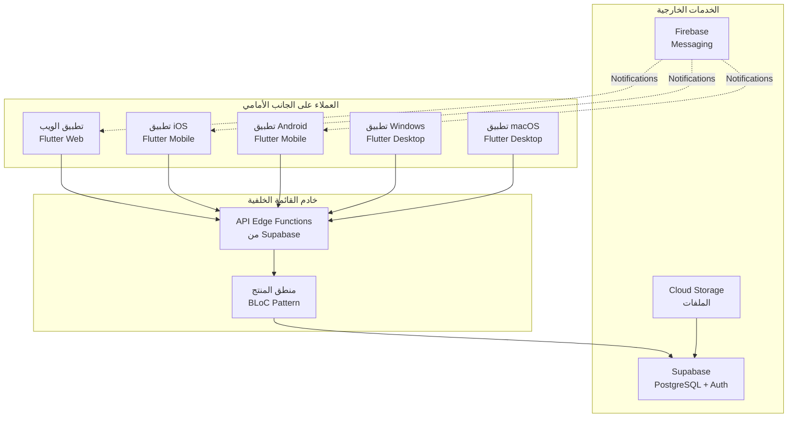
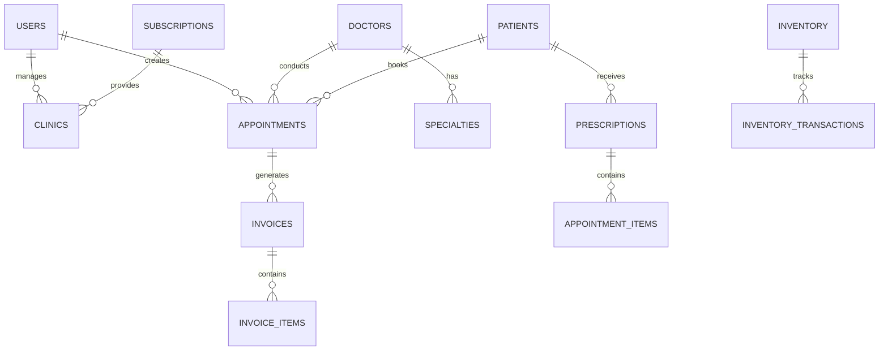

# تصميم النظام

## البنية المعمارية الكلية



---

## نموذج النظام المعماري

### Clean Architecture (الهندسة النظيفة)

نستخدم Clean Architecture بثلاث طبقات:

```
┌─────────────────────────────────────┐
│   Presentation Layer (UI)           │
│   - Screens (الشاشات)               │
│   - Widgets (الأدوات)              │
│   - BLoC (حالة التطبيق)            │
└─────────────────────────────────────┘
           ↓ يعتمد على ↓
┌─────────────────────────────────────┐
│   Domain Layer (المنطق)             │
│   - Entities (الكيانات)             │
│   - Use Cases (حالات الاستخدام)    │
│   - Repository Interfaces           │
└─────────────────────────────────────┘
           ↓ يعتمد على ↓
┌─────────────────────────────────────┐
│   Data Layer (البيانات)            │
│   - Models (النماذج)                │
│   - Data Sources (مصادر البيانات)   │
│   - Repository Implementation       │
└─────────────────────────────────────┘
```

### تدفق البيانات

```
User Action → Screen → BLoC Event
    ↓
    Use Case (Repository Method)
    ↓
    Data Layer (API/Local DB)
    ↓
    Data → Failure/Success
    ↓
    BLoC State Update
    ↓
    Screen Rebuild
```

---

## نمط BLoC للإدارة الحالة

### BLoC Components

| المكون | الوصف | الدور |
|--------|--------|------|
| **Event** | الحدث المدخل | تمثيل سلوك المستخدم |
| **BLoC** | وحدة المعالجة | معالجة الأحداث وإصدار الحالات |
| **State** | حالة الإخراج | تمثيل حالة الشاشة |
| **Repository** | مقدم البيانات | توفير البيانات |

### مثال على تدفق BLoC

```dart
// 1. Event
AuthLoginRequested(email, password);

// 2. BLoC Handler
on<AuthLoginRequested>((event, emit) async {
  emit(const AuthLoading());
  final result = await loginUseCase(
    email: event.email,
    password: event.password,
  );
  result.fold(
    (failure) => emit(AuthFailure(failure.message)),
    (success) => emit(AuthSuccess(success)),
  );
});

// 3. State
abstract class AuthState extends Equatable {}
class AuthLoading extends AuthState {}
class AuthSuccess extends AuthState {}
class AuthFailure extends AuthState {}
```

---

## معمارية قاعدة البيانات

### علاقات الكيانات الرئيسية



### الجداول الرئيسية

| الجدول | الوصف | الأهمية |
|--------|--------|----------|
| users | جميع المستخدمين | حرج |
| patients | معلومات المرضى | حرج |
| doctors | معلومات الأطباء | حرج |
| clinics | معلومات العيادات | حرج |
| appointments | المواعيد | حرج |
| prescriptions | الوصفات | عالي |
| invoices | الفواتير | عالي |
| inventory | المخزون | متوسط |
| subscriptions | الاشتراكات | حرج |

---

## سياسات الأمان على مستوى الصف (RLS)

### أمثلة على سياسات RLS

```sql
-- مثال: المريض يمكنه فقط رؤية تعيينته الخاصة
CREATE POLICY patient_see_own_appointments
  ON appointments FOR SELECT
  USING (patient_id = auth.uid());

-- مثال: الطبيب يمكنه فقط رؤية تعيينات مريضه
CREATE POLICY doctor_see_assigned_appointments
  ON appointments FOR SELECT
  USING (doctor_id = auth.uid());

-- مثال: المريض لا يمكنه تعديل البيانات المالية
CREATE POLICY patient_cannot_modify_invoices
  ON invoices FOR UPDATE
  USING (false);
```

### مستويات الأمان

```
┌────────────────────────────┐
│   Authentication Layer      │
│   (Supabase GoTrue Auth)   │
└────────────────────────────┘
           ↓
┌────────────────────────────┐
│   Authorization Layer       │
│   (Role-Based Access)      │
└────────────────────────────┘
           ↓
┌────────────────────────────┐
│   RLS Policies Layer       │
│   (Row-Level Security)     │
└────────────────────────────┘
           ↓
┌────────────────────────────┐
│   Database Objects         │
│   (Tables, Columns)        │
└────────────────────────────┘
```

---

## نمط الخدمات (Service Layer)

### الخدمات الأساسية

| الخدمة | الوصف | طريقة الاستخدام |
|--------|--------|------------|
| `AuthService` | المصادقة | تسجيل الدخول/الخروج |
| `SupabaseService` | عمليات قاعدة البيانات | CRUD Operations |
| `StorageService` | تخزين الملفات | تحميل/تنزيل الملفات |
| `NotificationService` | الإشعارات | إرسال تنبيهات |
| `SmsService` | رسائل SMS | التحقق بـ OTP |

### مثال على الخدمة

```dart
class AuthService {
  Future<AuthResponse> login({
    required String email,
    required String password,
  }) async {
    try {
      final response = await _supabaseClient.auth.signInWithPassword(
        email: email,
        password: password,
      );
      return AuthResponse(user: response.user);
    } catch (e) {
      throw AuthException(message: e.toString());
    }
  }
}
```

---

## نمط الاعتماديات (Dependency Injection)

### GetIt Configuration

```dart
final getIt = GetIt.instance;

Future<void> setupServiceLocator() async {
  // External services
  getIt.registerSingleton<SupabaseClient>(
    SupabaseConfig.client,
  );
  
  // Services
  getIt.registerLazySingleton<AuthService>(
    () => AuthService(getIt<SupabaseClient>()),
  );
  
  // Repositories
  getIt.registerLazySingleton<AuthRepository>(
    () => AuthRepositoryImpl(getIt<AuthService>()),
  );
  
  // Use Cases
  getIt.registerLazySingleton<LoginUseCase>(
    () => LoginUseCase(getIt<AuthRepository>()),
  );
  
  // BLoC
  getIt.registerFactory<AuthBloc>(
    () => AuthBloc(getIt<LoginUseCase>()),
  );
}
```

---

## نمط الأخطاء والفشل

### هيكل معالجة الأخطاء

```dart
// Result Pattern (Either)
Either<Failure, Success>

// مثال
final result = await loginUseCase(email, password);
result.fold(
  (failure) => print('Error: ${failure.message}'),
  (success) => print('Logged in: ${success.user.name}'),
);
```

### أنواع الأخطاء

| النوع | الوصف | الحالة |
|------|--------|--------|
| `ServerFailure` | خطأ الخادم | 500 |
| `UnauthorizedException` | عدم المصادقة | 401 |
| `ForbiddenException` | عدم الترخيز | 403 |
| `NotfoundFailure` | غير موجود | 404 |
| `NetworkFailure` | فشل الاتصال | Offline |
| `CacheFailure` | فشل التخزين المؤقت | Local |

---

## نمط التخزين المحلي (Local Storage)

### مستودعات التخزين

| المستودع | الاستخدام | الأمان |
|----------|----------|--------|
| `SharedPreferences` | البيانات غير الحساسة | متوسط |
| `FlutterSecureStorage` | بيانات حساسة (tokens) | عالي |
| `Hive` | البيانات المحلية الكبيرة | متوسط |
| `SQLite` | البيانات المعقدة | متوسط |

---

## تسلسل الاتصال (Call Stack)

### مثال على تسلسل اتصال كامل

```
1. User taps "Login" button
   ↓
2. Screen → AuthBloc.add(LoginRequested(email, password))
   ↓
3. BLoC → LoginUseCase(email, password)
   ↓
4. UseCase → AuthRepository.login(email, password)
   ↓
5. Repository → AuthService.login(email, password)
   ↓
6. Service → SupabaseClient.auth.signInWithPassword()
   ↓
7. Response → Result<User>
   ↓
8. Back to BLoC → emit(AuthSuccess(user))
   ↓
9. Screen rebuilds with new state
   ↓
10. User navigates to home screen
```

---

## الترويسات والميتاتا (Metadata)

### معايير الكود

- **Framework**: Flutter
- **Language**: Dart
- **Pattern**: Clean Architecture + BLoC
- **State Management**: flutter_bloc
- **Dependency Injection**: GetIt
- **Analysis**: very_good_analysis

### ترتيب الاستيراد (Import Order)

```dart
// 1. Dart imports
import 'dart:async';
import 'dart:convert';

// 2. Flutter imports
import 'package:flutter/material.dart';
import 'package:flutter_bloc/flutter_bloc.dart';

// 3. Package imports
import 'package:equatable/equatable.dart';

// 4. Relative imports
import '../models/user.dart';
import '../services/auth_service.dart';
```

