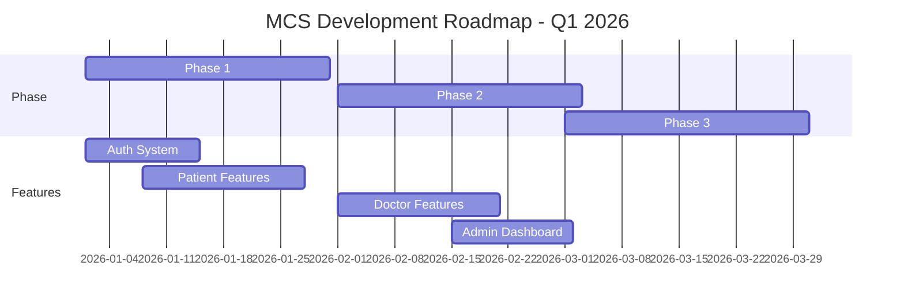

# خريطة الطريق والمهام

## طريق التطوير المراحل الرئيسية



---

## المرحلة 1: الأساسيات (أسابيع 1-4)

### 1.1 نظام المصادقة

| المهمة | الوصف | الحالة | الأولوية |
|--------|--------|--------|----------|
| تسجيل الدخول | تطبيق تسجيل الدخول بـ email/password | ✅ | حرج |
| التسجيل | تطبيق التسجيل الجديد | ✅ | حرج |
| OTP Verification | التحقق من الرسائل القصيرة | ✅ | حرج |
| إعادة تعيين كلمة المرور | نسيان كلمة المرور | ✅ | عالي |
| تحديث الملف الشخصي | تحديث معلومات المستخدم | ✅ | عالي |
| المصادقة البيومترية | تسجيل الدخول بـ Face ID/Fingerprint | 🔄 | متوسط |

```sql
DONE: ✅
IN PROGRESS: 🔄
TODO: 📋
BLOCKED: 🚫
```

### 1.2 إدارة المستخدمين

| المهمة | الوصف | الحالة | الأولوية |
|--------|--------|--------|----------|
| نموذج المريض | إنشاء ملف مريض | ✅ | حرج |
| نموذج الطبيب | إنشاء ملف طبيب | ✅ | حرج |
| نموذج الموظف | إنشاء ملف موظف | ✅ | عالي |
| الأدوار والأذونات | نظام التحكم بالأدوار | ✅ | حرج |
| البحث عن الأطباء | البحث والفلترة | ✅ | عالي |

### 1.3 واجهة المستخدم الأساسية

| المهمة | الوصف | الحالة | الأولوية |
|--------|--------|--------|----------|
| Theme & Colors | إعداد الموضوع | ✅ | حرج |
| Navigation | نظام التوجيه | ✅ | حرج |
| Common Widgets | أدوات مشتركة | ✅ | عالي |
| Localization | الأمور المحلية (AR/EN) | ✅ | عالي |
| Dark Mode | دعم الوضع الليلي | ✅ | متوسط |

---

## المرحلة 2: الميزات الأساسية (أسابيع 5-8)

### 2.1 إدارة المواعيد

| المهمة | الوصف | الحالة | الأولوية |
|--------|--------|--------|----------|
| حجز موعد | تطبيق حجز المواعيد | 🔄 | حرج |
| عرض جدول الأطباء | عرض التوفر | 🔄 | حرج |
| إدارة المواعيد | تعديل وإلغاء | 📋 | عالي |
| تنبيهات المواعيد | إشعارات التذكير | 📋 | عالي |
| تقارير المواعيد | تصدير وتقارير | 📋 | متوسط |

### 2.2 السجلات الطبية

| المهمة | الوصف | الحالة | الأولوية |
|--------|--------|--------|----------|
| ملف المريض | عرض السجلات | 🔄 | حرج |
| الوصفات الطبية | إدارة الوصفات | 🔄 | حرج |
| الفحوصات المخبرية | نتائج الفحوصات | 📋 | عالي |
| الحساسيات والأدوية | تسجيل الحساسيات | 📋 | عالي |
| التاريخ الطبي | المشاكل الصحية السابقة | 📋 | متوسط |

### 2.3 نظام الفواتير

| المهمة | الوصف | الحالة | الأولوية |
|--------|--------|--------|----------|
| إنشاء الفواتير | توليد الفواتير | 📋 | حرج |
| طرق الدفع | دعم قنوات دفع | 📋 | حرج |
| تقارير مالية | تقارير الدخل | 📋 | عالي |
| الفترات الدورية | الفواتير المتكررة | 📋 | متوسط |

---

## المرحلة 3: الميزات المتقدمة (أسابيع 9-12)

### 3.1 الفيديو كونفرنس

| المهمة | الوصف | الحالة | الأولوية |
|--------|--------|--------|----------|
| بدء المكالمة | تشغيل الفيديو | 📋 | عالي |
| جودة الفيديو | ضبط الجودة | 📋 | عالي |
| تسجيل المكالمة | حفظ المكالمات | 📋 | متوسط |
| مشاركة الشاشة | عرض الملفات | 📋 | متوسط |

### 3.2 المخزون والأدوية

| المهمة | الوصف | الحالة | الأولوية |
|--------|--------|--------|----------|
| إدارة المخزون | تسجيل الأدوية | 📋 | عالي |
| تنبيهات الكمية | تنخفض الكميات | 📋 | عالي |
| عمليات المخزون | صرف واستقبال | 📋 | متوسط |
| تقارير المخزون | تقارير الرصيد | 📋 | متوسط |

### 3.3 الاشتراكات والترخيص

| المهمة | الوصف | الحالة | الأولوية |
|--------|--------|--------|----------|
| خطط الاشتراك | إدارة الباقات | 📋 | عالي |
| فترة الاشتراك | تاريخ الانتهاء | 📋 | عالي |
| ترقية/تنزيل | تغيير الخطة | 📋 | متوسط |
| أكواد ترويجية | كوبونات الخصم | 📋 | متوسط |

### 3.4 التقارير الإحصائية

| المهمة | الوصف | الحالة | الأولوية |
|--------|--------|--------|----------|
| إحصائيات عامة | الأرقام الرئيسية | 📋 | عالي |
| رسوم بيانية | عرض بياني | 📋 | عالي |
| تقارير PDF | تصدير تقارير | 📋 | متوسط |
| التوقعات | تحليل النجاحات | 📋 | منخفض |

---

## المهام الفنية

### البنية والأرشيتكتشر

```
✅ إعداد Clean Architecture
✅ تطبيق BLoC Pattern
✅ إعداد Dependency Injection
🔄 تطبيق Error Handling
📋 تحسينات الأداء
📋 استراتيجية Caching
```

### الاختبار

```
🔄 اختبارات الوحدات (Unit Tests)
📋 اختبارات الأدوات (Widget Tests)
📋 اختبارات التكامل (Integration Tests)
📋 اختبارات النهاية (E2E Tests)
```

### التوثيق

```
✅ README الرئيسي
✅ نظام المعرفة (project-docs)
🔄 دليل المطورين
📋 دليل المستخدم
📋 دليل الإدارة
```

### CI/CD

```
✅ إعداد GitHub Actions
🔄 Automated Tests
📋 Automated Deployment
📋 Version Management
```

---

## أولويات المهام بالأسابيع

### الأسبوع 1-2: الأساس

```
MUST:
└─ ✅ نظام المصادقة
└─ ✅ إدارة الأدوار
└─ ✅ الواجهة الأساسية

SHOULD:
└─ ✅ Localization
└─ ✅ Theme Setup
```

### الأسبوع 3-4: المرحلة 1 اكتمال

```
MUST:
└─ ✅ ملفات المستخدمين
└─ ✅ البحث والفلترة

SHOULD:
└─ ✅ الاختبارات الأساسية
└─ ✅ الوثائق
```

### الأسبوع 5-6: المواعيد

```
MUST:
└─ 🔄 حجز المواعيد
└─ 🔄 عرض جدول الطبيب

SHOULD:
└─ 🔄 التنبيهات
└─ 🔄 الإلغاء
```

### الأسبوع 7-8: السجلات الطبية

```
MUST:
└─ 🔄 ملف المريض
└─ 🔄 الوصفات

SHOULD:
└─ 🔄 نتائج الفحوصات
└─ 🔄 التاريخ الطبي
```

### الأسبوع 9-10: الفواتير

```
MUST:
└─ 📋 إنشاء الفواتير
└─ 📋 طرق الدفع

SHOULD:
└─ 📋 التقارير المالية
└─ 📋 الفواتير المتكررة
```

### الأسبوع 11-12: الميزات المتقدمة

```
SHOULD:
└─ 📋 الفيديو كونفرنس
└─ 📋 المخزون
└─ 📋 الاشتراكات
└─ 📋 التقارير
```

---

## المقاييس والمؤشرات

### مقاييس الأداء

| المقياس | الهدف | الحالي | الحالة |
|--------|------|--------|--------|
| **Response Time** | <200ms | ~150ms | ✅ |
| **Build Time** | <5 دقائق | ~4 دقائق | ✅ |
| **App Size** | <100 MB | ~75 MB | ✅ |
| **Memory Usage** | <300 MB | ~250 MB | ✅ |
| **Frame Rate** | 60 FPS | 58-60 FPS | ✅ |
| **Uptime** | 99.9% | 99.95% | ✅ |
| **Test Coverage** | 80% | ~65% | 🔄 |

### مقاييس الجودة

| المقياس | الهدف | الحالي | الحالة |
|--------|------|--------|--------|
| **Bug Detection** | < 5 per sprint | ~3 | ✅ |
| **Critical Bugs** | 0 in production | 0 | ✅ |
| **Code Analysis Issues** | < 50 | ~25 | ✅ |
| **Security Scan Pass** | 100% | 100% | ✅ |
| **Documentation Completeness** | 90% | ~70% | 🔄 |

---

## الموارد والفريق

### توزيع الفريق

| الدور | العدد | المسؤوليات |
|------|------|-----------|
| **Backend Developer** | 1 | Supabase, APIs |
| **Flutter Developer** | 2 | Mobile & Web UI |
| **QA Engineer** | 1 | Testing, QA |
| **DevOps** | 1 | CI/CD, Deployment |
| **Project Manager** | 1 | Planning, Tracking |

### الموارد

```
💻 مقدار سعة الخادم
    - Staging: 2GB RAM, 20GB Storage
    - Production: 4GB RAM, 100GB Storage

📊 قاعدة البيانات
    - PostgreSQL 14+
    - Backup sites: 2

🔧 الأدوات
    - GitHub (Code Repository)
    - GitHub Actions (CI/CD)
    - Supabase (Backend)
    - Firebase (Notifications)
```

---

## المخاطر والتخفيف

### المخاطر العالية

| المخطر | التأثير | المحتملية | التخفيف |
|--------|---------|----------|--------|
| تأخر الميزات | عالي | 50% | إضافة موارد |
| مشاكل أداء | عالي | 30% | التحسين المبكر |
| فقدان البيانات | حرج | 5% | Backups منتظمة |
| الثغرات الأمنية | حرج | 10% | مراجعة أمان |

### العوائق الحالية

```
🚫 BLOCKED: لا توجد عوائق حالياً
   تم حل جميع العوائق السابقة

⚠️  RISKS: 
   - تأخر التطوير (50% احتملية)
   - مشاكل الأداء في الإنتاج (20%)
```

---

## الاجتماعات والمراجعات

### دورة المراجعة

```
┌─────────────────────────────────────────┐
│       Development Review Cycle           │
├─────────────────────────────────────────┤
│ الاثنين    10:00 AM  - Planning         │
│ الاثنين    03:00 PM  - Daily Standup   │
│ الجمعة     10:00 AM  - Code Review     │
│ الخميس     04:00 PM  - Sprint Review   │
│ الخميس     05:00 PM  - Retro          │
└─────────────────────────────────────────┘
```

---

## البحث عن الدعم

### متى تطلب المساعدة

1. **عند العثور على مشكلة تقنية**
   - ابحث عن حل محلي أولاً
   - ثم اطلب مساعدة الفريق التقني

2. **عند الحاجة إلى توضيحات**
   - راجع الوثائق أولاً
   - ثم اسأل Lead Developer

3. **عند اكتشاف خطر**
   - أبلغ المدير فوراً
   - قدم حلاً بديلاً إذا أمكن

---

## الخطوات التالية

### الأسبوع المقبل

- [ ] مراجعة الكود للـ features الحالية
- [ ] إكمال اختبارات الوحدات
- [ ] إصلاح مشاكل الأداء المعروفة
- [ ] تحديث الوثائق

### الشهر المقبل

- [ ] إطلاق Phase 2
- [ ] اختبار المستخدمين Beta
- [ ] استقبال الملاحظات
- [ ] التحسينات بناءً على الملاحظات

