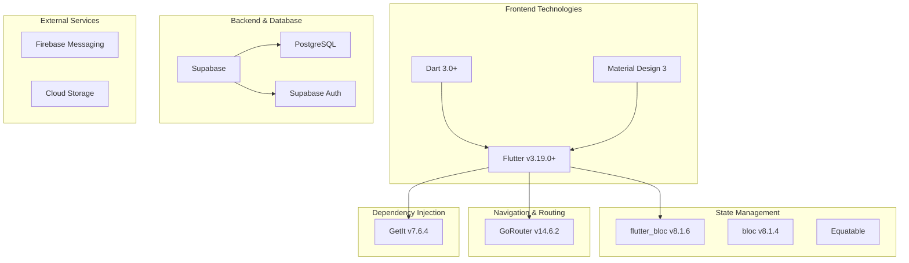

# التقنيات والتكنولوجيا

## ملخص التكنولوجيات



---

## القائمة الكاملة للمكتبات

### المكتبات الأساسية

| المكتبة | الإصدار | الوصف | الاستخدام |
|---------|---------|--------|----------|
| `flutter` | >=3.19.0 | إطار عمل الواجهات | كل شيء |
| `dart` | >=3.0.0 | لغة البرمجة | أساس المشروع |
| `material_design_icons` | latest | أيقونات Material | UI |
| `cupertino_icons` | latest | أيقونات iOS | iOS designs |

### إدارة الحالة (State Management)

| المكتبة | الإصدار | الوصف الدقيق |
|---------|---------|----------|
| `flutter_bloc` | ^8.1.6 | إدارة الحالة باستخدام BLoC |
| `bloc` | ^8.1.4 | منطق BLoC الأساسي |
| `equatable` | ^2.0.5 | مقارنة القيم بسهولة |
| `bloc_concurrency` | ^0.2.2 | معالجة التزامن في BLoC |

### الحقن الاعتمادي (Dependency Injection)

| المكتبة | الإصدار | الوصف |
|---------|---------|--------|
| `get_it` | ^7.6.4 | حاوي الخدمات والاعتماديات |

### التوجيه والملاحة (Navigation & Routing)

| المكتبة | الإصدار | الوصف |
|---------|---------|--------|
| `go_router` | ^14.6.2 | توجيه قائم على الأسماء |
| `app_links` | latest | معالجة الروابط العميقة |

### المصادقة والأمان (Authentication & Security)

| المكتبة | الإصدار | الوصف |
|---------|---------|--------|
| `supabase_flutter` | ^2.0.0 | Supabase SDK |
| `flutter_secure_storage` | ^9.0.0 | تخزين آمن للـ tokens |
| `local_auth` | ^2.3.0 | المصادقة البيومترية |

### قاعدة البيانات

| المكتبة | الإصدار | الوصف |
|---------|---------|--------|
| `postgres` | ^3.0.0 | عميل PostgreSQL |
| `sqflite` | ^2.2.0+ | قاعدة بيانات محلية SQLite |

### الإشعارات والمراسلة

| المكتبة | الإصدار | الوصف |
|---------|---------|--------|
| `firebase_messaging` | ^14.6.0 | Firebase Cloud Messaging |
| `firebase_core` | ^3.0.0 | Firebase Core |
| `flutter_local_notifications` | ^17.0.0 | إشعارات محلية |

### التخزين السحابي (Cloud Storage)

| المكتبة | الإصدار | الوصف |
|---------|---------|--------|
| `firebase_storage` | ^11.1.0 | Firebase Storage |
| `path_provider` | ^2.0.0 | مسارات التطبيق |

### الوسائط والملفات (Media & Files)

| المكتبة | الإصدار | الوصف |
|---------|---------|--------|
| `image_picker` | ^1.0.0 | التقاط الصور |
| `file_picker` | ^5.2.0 | اختيار الملفات |
| `pdf` | ^3.10.0 | معالجة PDFs |
| `flutter_webrtc` | ^0.9.0 | الفيديو كونفرنس |

### الشبكة والاتصالات

| المكتبة | الإصدار | الوصف |
|---------|---------|--------|
| `http` | ^1.1.0 | طلبات HTTP |
| `dio` | ^5.3.0 | عميل HTTP متقدم |
| `connectivity_plus` | ^5.0.0 | كشف الاتصال |
| `socket_io_client` | ^2.0.0 | اتصالات فورية |

### التوطين والترجمة (Localization)

| المكتبة | الإصدار | الوصف |
|---------|---------|--------|
| `intl` | ^0.20.2 | دعم لغات متعددة |
| `flutter_localizations` | varies | محلية Flutter |
| `easy_localization` | ^3.0.0 | إدارة الترجمة |

### الخطوط والطباعة (Fonts & Typography)

| المكتبة | الإصدار | الوصف |
|---------|---------|--------|
| `google_fonts` | ^6.0.0 | خطوط Google |
| `cupertino_icons` | ^1.0.0 | أيقونات Cupertino |

### التنسيقات والمنسقات (Formatting)

| المكتبة | الإصدار | الوصف |
|---------|---------|--------|
| `intl_utils` | ^2.8.0 | أدوات المنسقات |
| `mask_text_input_formatter` | ^2.4.0 | تنسيق النصوص |

### التخزين المحلي (Local Storage)

| المكتبة | الإصدار | الوصف |
|---------|---------|--------|
| `shared_preferences` | ^2.0.0 | تخزين تفضيلات المستخدم |
| `hive` | ^2.2.0 | قاعدة بيانات محلية NoSQL |
| `hive_flutter` | ^1.2.0 | Hive لـ Flutter |

### أدوات المراقبة والتتبع (Monitoring & Analytics)

| المكتبة | الإصدار | الوصف |
|---------|---------|--------|
| `firebase_analytics` | ^10.7.0 | تتبع الأحداث |
| `firebase_crashlytics` | ^3.4.0 | تتبع الأخطاء |
| `logger` | ^2.0.0 | تسجيل السجلات |

### اختبار والجودة (Testing & Quality)

| المكتبة | الإصدار | الوصف |
|---------|---------|--------|
| `test` | any | اختبارات الوحدة |
| `mocktail` | ^0.3.0 | mocking للاختبارات |
| `very_good_analysis` | latest | تحليل الكود |

### الأدوات الإضافية

| المكتبة | الإصدار | الوصف |
|---------|---------|--------|
| `flutter_svg` | ^2.0.0 | رسومات SVG |
| `cached_network_image` | ^3.2.0 | تخزين الصور المؤقت |
| `shimmer` | ^3.0.0 | تأثيرات تحميل |
| `lottie` | ^2.4.0 | رسوميات Lottie |
| `url_launcher` | ^6.1.0 | فتح الروابط |
| `share_plus` | ^7.1.0 | مشاركة المحتوى |
| `device_info_plus` | ^10.0.0 | معلومات الجهاز |
| `package_info_plus` | ^5.0.0 | معلومات التطبيق |
| `permission_handler` | ^11.4.0 | طلب الأذونات |

---

## البيئات والإعدادات

### الإعدادات المختلفة حسب المنصة

```yaml
# Web Configuration
SUPABASE_URL: https://your-project.supabase.co
SUPABASE_ANON_KEY: your-anon-key
FIREBASE_WEB_CONFIG: {...}

# Mobile Configuration (Android/iOS)
SUPABASE_URL: https://your-project.supabase.co
SUPABASE_ANON_KEY: your-anon-key
GOOGLE_SERVICES_JSON: {...}
```

### النسخ المتعددة (Flavors)

```bash
# Development
flutter run --flavor dev

# Staging
flutter run --flavor staging

# Production
flutter run --flavor prod
```

---

## متطلبات النظام

### متطلبات التطوير

| المتطلب | الإصدار | الوصف |
|--------|---------|--------|
| **Flutter SDK** | >=3.19.0 | إطار العمل |
| **Dart SDK** | >=3.0.0 | لغة البرمجة |
| **Android SDK** | >=30 | لتطوير Android |
| **Xcode** | >=14.0 | لتطوير iOS |
| **Visual Studio Code** | latest | محرر النصوص |

### المكتبات الضرورية على النظام

```bash
# Windows Requirements
- Visual Studio 2022 (with C++)
- CMake

# macOS Requirements
- Xcode Command Line Tools
- CocoaPods

# Linux Requirements
- Build essentials
- cmake
```

---

## خوادم ومخدمات خارجية

### Supabase

```
┌─────────────────────────────────────┐
│          SUPABASE PLATFORM           │
├─────────────────────────────────────┤
│ ✓ Authentication (GoTrue)            │
│ ✓ PostgreSQL Database                │
│ ✓ Real-time Subscriptions            │
│ ✓ Cloud Storage                      │
│ ✓ Edge Functions                     │
│ ✓ Vector Embeddings                  │
└─────────────────────────────────────┘
```

### Firebase

```
┌─────────────────────────────────────┐
│          FIREBASE SERVICES           │
├─────────────────────────────────────┤
│ ✓ Cloud Messaging (FCM)              │
│ ✓ Cloud Storage                      │
│ ✓ Analytics                          │
│ ✓ Crashlytics                        │
│ ✓ Remote Config                      │
└─────────────────────────────────────┘
```

---

## أدوات التطوير والبناء

### أدوات سطر الأوامر

| الأداة | الإصدار | الاستخدام |
|--------|---------|----------|
| `flutter` | 3.19.0+ | أداة CLI الرئيسية |
| `dart` | 3.0.0+ | أداة Dart |
| `pub` | latest | مدير الحزم |
| `android` | SDK 34+ | تطوير Android |

### أدوات المراقبة والتحليل

| الأداة | الوصف |
|--------|--------|
| `flutter analyze` | تحليل الكود |
| `flutter test` | اختبار الوحدات |
| `coverage` | تغطية الاختبار |
| `dartfmt` | تنسيق الكود |

### أدوات CI/CD

| الأداة | الوصف |
|--------|--------|
| `GitHub Actions` | تنفيذ العمليات التلقائية |
| `Firebase App Distribution` | توزيع الاختبارات |
| `Play Store Console` | نشر Android |
| `App Store Connect` | نشر iOS |

---

## مجموعات الإعتماديات (Dependency Groups)

### إعتماديات الإنتاج

```yaml
dependencies:
  flutter:
    sdk: flutter
  flutter_bloc: ^8.1.6
  supabase_flutter: ^2.0.0
  get_it: ^7.6.4
  go_router: ^14.6.2
  firebase_messaging: ^14.6.0
  # ... More dependencies
```

### الإعتماديات الإنمائية

```yaml
dev_dependencies:
  flutter_test:
    sdk: flutter
  mocktail: ^0.3.0
  test: any
  very_good_analysis: latest
  build_runner: ^2.4.0
  # ... More dev dependencies
```

---

## معايير الأداء

### متطلبات الأداء

| المقياس | الهدف | المقبول |
|---------|------|----------|
| **Frame Rate** | 60 FPS | ≥ 50 FPS |
| **Build Time** | 5 دقائق | ≤ 10 دقائق |
| **App Size** | 50 MB | ≤ 100 MB |
| **Memory Usage** | 200 MB | ≤ 500 MB |
| **Load Time** | 2 ثانية | ≤ 5 ثوان |

---

## استراتيجية التحديث

### نسخ الإصدارات

```
Semantic Versioning: MAJOR.MINOR.PATCH

v1.0.0 ─ Major version (breaking changes)
   v1.1.0 ─ Minor version (new features)
      v1.0.1 ─ Patch version (bug fixes)
```

### دورة التحديث

| الدورة | التكرار | الوصف |
|--------|---------|--------|
| **Security** | فوري | تحديثات الأمان الحرجة |
| **Hotfix** | أسبوعي | إصلاحات مهمة |
| **Minor** | شهري | ميزات وتحسينات |
| **Major** | ربع سنوي | تغييرات كبيرة |

